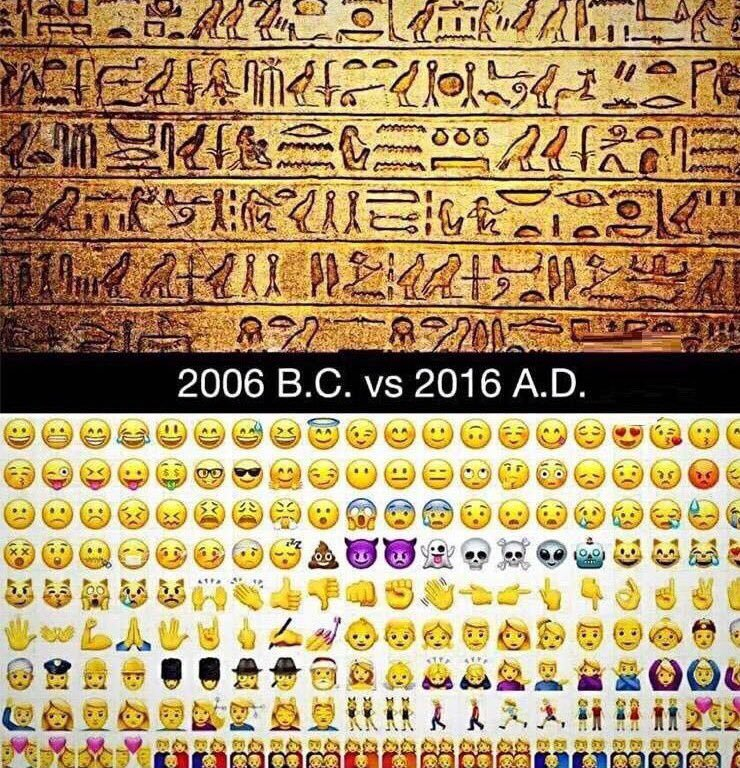

## 👋 👉 &#x1F1EA;&#x1F1EC; 😀

### translation

## Hello and welcome to emojiglyphs

What is emojiglyphs?
`A story, sentance or set of emotions conveyed with a series of emojis while texting and in social media.`

(Source: https://www.urbandictionary.com/define.php?term=Emojiglyph)

Maybe someone still remembers this picture:

This is a fun project, creating stories with emojis like the old egypts did that with there hieroglyphs. So this is why I created emojiglyphs for fun.

I saw some hashtags for [#emojiglyph](https://twitter.com/search?q=%23emojiglyph) and [#emojiglyphs](https://twitter.com/search?q=%23emojiglyphs) on twitter, maybe we can use it again :). I saw only a couple of them.